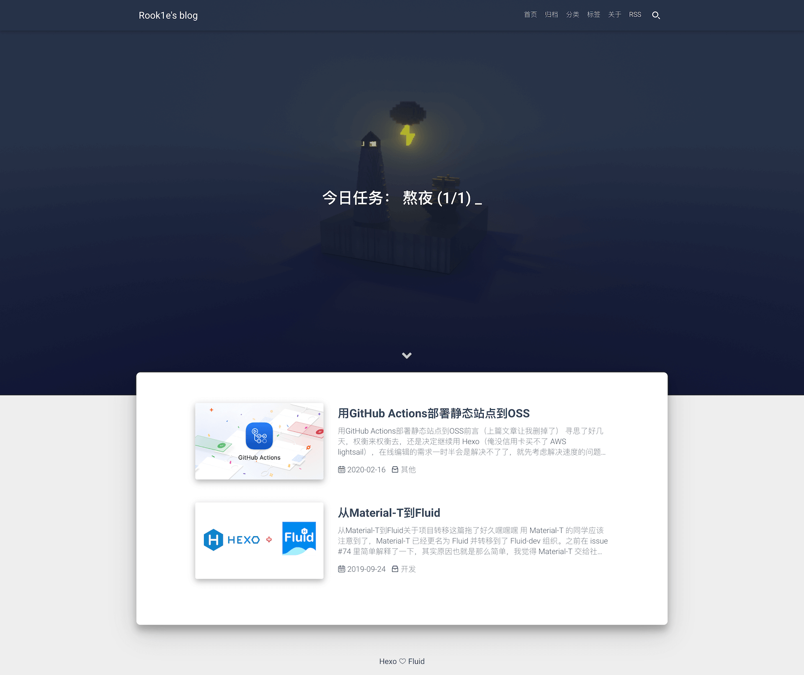
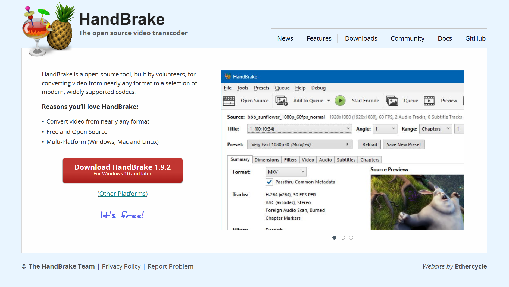
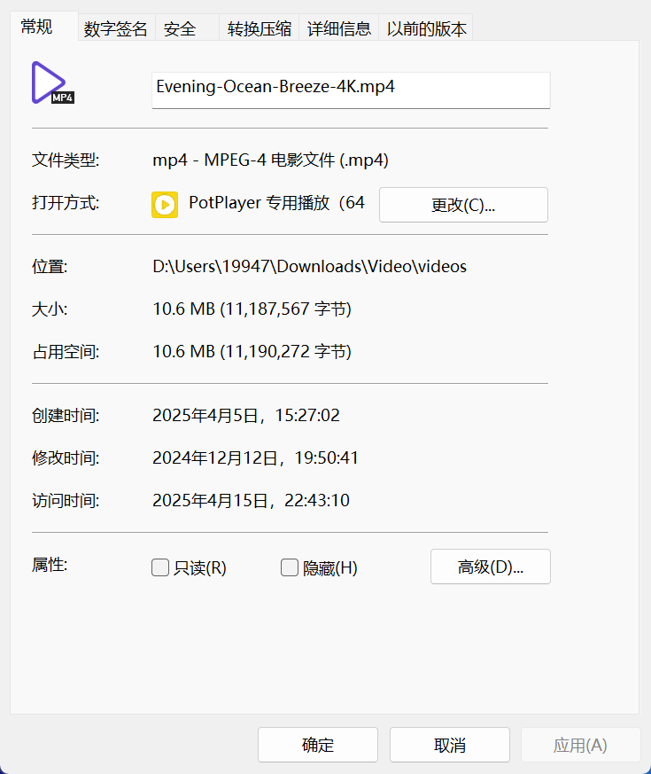
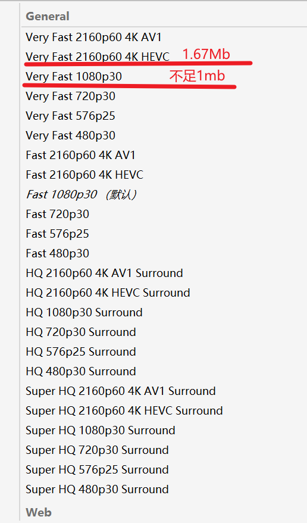

# 简介

### 引言

当大家使用Fluid主题搭建好博客后，看着默认的背景图片是否会觉得单调？

即使切换图片也感觉效果不佳？看着别人既美观又实用的博客傻傻发呆？



本文主要记录个人对Fluid主题的进行改造，从而实现视频背景功能的过程。注意！本文部分核心代码是借助deepseek生成，此方案可能不是最优解，如您有更好的意见欢迎评论区交流。


### 版本信息

起初在翻阅相关教程时，发现很多内容无法复现。主要原因是Fluid主题版本不同，各版本之间的项目结构会有差异。

所以第一步是明确自己Fluid版本信息

打开`本地项目\themes\fluid\package.json`文件

```
 "name": "hexo-theme-fluid",
 "version": "1.9.8",
 "description": "An elegant Material-Design theme for Hexo.",
```

可以看到目前我的版本是1.9.8，其他版本无法保证效果


### 分析

1. 我的博客使用GitHub pages构建，并且本人学生党追求尽可能0成本实现所需功能。

   考虑到CDN可能会产生费用问题，以及部分免费CDN对大陆支持较差，

   所以采用了加载本地视频方式来实现视频背景功能，并没有使用CDN，如有需要请自行研究。

2. 为防止出现视频背景加载失败的情况，需要添加poster备用方案。

   即先加载静态图片，待视频缓冲完毕后，通过毛玻璃渐变效果过渡到视频背景，若无法加载视频背景，则只显示静态图片。

3. 避免直接修改主题文件，必要修改通过[Fluid-注入代码](https://hexo.fluid-dev.com/docs/advance/#fluid-%E6%B3%A8%E5%85%A5%E4%BB%A3%E7%A0%81)机制实现，确保更新主题时不会覆盖修改，方便后续维护和扩展。


# 素材准备

### 视频

视频背景的下载可以到[致美化](https://zhutix.com/)，点击顶栏的动态壁纸。

也可以使用自己喜爱的其他视频。

选择好视频后需要注意原始视频文件过大，直接使用会造成加载时间过长，我们需要对其压缩

那么压缩视频的话推荐使用[HandBrake](https://handbrake.fr/)



例如我目前在用的视频背景，原始大小为10.6MB



使用`HandBrake`根据自己的需求选择合适的预设进行压缩后，视频体积大幅减小，视频总大小控制在2Mb以内即可




### 图片

截取视频第一帧画面，谷歌搜索图片压缩，找一个网站压缩一下，大小最好在200Kb以内。

技术好、追求严谨细节的也可以使用ffmpeg。

我这里使用的是jpg格式，所以修改文件名为`video-poster.jpg`


### 目录

准备好的图片和视频文件，按照如下放置

```
├──项目根目录
	├── source	
		├─images
		│      video-poster.jpg
		├─videos
		│      video-background.mp4
```

若`source`下无对应文件夹需手动创建，后文遇此情况同理不再赘述


# 代码

### `_config.fluid.yml`

打开`_config.fluid.yml`配置文件，如没有此文件请查看文档[Fluid-覆盖配置](https://hexo.fluid-dev.com/docs/guide/#%E8%A6%86%E7%9B%96%E9%85%8D%E7%BD%AE)

将默认`banner_img`按CTRL+/注释掉，添加`banner_img: transparent`，头图高度保持100，同理将不透明度改为0。

```
  # 首页 Banner 头图，可以是相对路径或绝对路径，以下相同
  # Path of Banner image, can be a relative path or an absolute path, the same on other pages
  # banner_img: /img/default.png
  banner_img: transparent  # 强制透明背景图

  # 头图高度，屏幕百分比
  # Height ratio of banner image
  # Available: 0 - 100
  banner_img_height: 100

  # 头图黑色蒙版的不透明度，available: 0 - 1.0，1 是完全不透明
  # Opacity of the banner mask, 1.0 is completely opaque
  # Available: 0 - 1.0
  # banner_mask_alpha: 0.3
  banner_mask_alpha: 0
```

由于`_config.fluid.yml`对于不同页面的背景图片以及不透明度是分开控制的，

所以依次修改首页、文章页、分类页、标签页、关于页、自定义页、404页、友链页等页面Banner 头图配置至上文状态


### Fluid-注入代码

打开本地项目，创建`项目根目录\scripts\video-injector.js`

`Hexo` 在生成静态网站时会自动加载此文件夹下的脚本，而`injects.bodyBegin.file`代码功能是将`source/_inject/video-bg.ejs`文件注入到`bodyBegin`位置。

```
hexo.extend.filter.register('theme_inject', function(injects) {
  injects.bodyBegin.file('video-background', 
    'source/_inject/video-bg.ejs', 
    {}, 
    { cache: true }, 
    -99 // 确保优先加载
  );
});
```

因此接下来创建`项目根目录\source\_inject\video-bg.ejs`文件

```
<div class="video-container">
  <video 
    class="video-background" 
    autoplay 
    loop 
    muted 
    playsinline
    preload="none"
    poster="<%= url_for('/images/video-poster.jpg') %>"
  >
    <source src="<%= url_for('/videos/video-background.mp4') %>" type="video/mp4">
    " 
    style="width:100%; height:100%; object-fit: cover">
  </video>
</div>
```

注意！需要将`video-bg.ejs`文件中的`<%= url_for('/videos/video-background.mp4') %>`以及两个`<%= url_for('/images/video-poster.jpg') %>`修改为自己的路径。

此处路径的写法为相对路径，因为`Hexo`会将source目录下的文件复制到public目录中，用户将视频文件放在source/videos/下，封面图放在source/images/下，在配置中使用/videos/...和/images/...即可。

如果您已按照上文放置到了正确文件夹，仅需注意路径的文件名即可。


### CSS

创建`项目根目录\source\css\video-background.css`，写入以下内容

```
.video-container {
  position: fixed;
  top: 0;
  left: 0;
  right: 0;
  bottom: 0;
  overflow: hidden;
  z-index: 0;

  &::before {
    content: "";
    position: absolute;
    top: 0;
    left: 0;
    right: 0;
    bottom: 0;
    background: rgba(0,0,0,0.4);
    z-index: 1;
    transition: 
      opacity 1.2s cubic-bezier(0.4, 0, 0.2, 1),
      backdrop-filter 1.2s ease; /* 分离过渡属性 */
    backdrop-filter: blur(20px);/* 毛玻璃效果 */
  }

  &.video-loaded::before {
    opacity: 0;
    backdrop-filter: blur(0);
  }
}

.video-container video {
  min-width: 100%;
  min-height: 100%;
  width: auto;
  height: auto;
  object-fit: cover;
  position: absolute;
  top: 50%;
  left: 50%;
  transform: translate(-50%, -50%);
  pointer-events: none;
}

body {
  position: relative;
  min-height: 100vh;
  display: flex;
  flex-direction: column;
}

/* 确保内容显示在视频上方 */
main, footer {
  position: relative;
  z-index: 1;
  background: transparent;
}

/* 覆盖原有header样式 */
header.navbar {
  position: fixed !important;  /* 固定定位 */
  top: 0;
  width: 100%;
  z-index: 1000 !important;    /* 必须高于视频容器 */
}


/* 移动端适配 */
@media (max-aspect-ratio: 16/9) {
  .video-container video {
    width: auto;
    height: 100%;
  }
}

@media (min-aspect-ratio: 16/9) {
  .video-container video {
    width: 100%;
    height: auto;
  }
}
```


### JS

创建`项目根目录\source\js\video-loader.js`，写入以下内容

```
document.addEventListener('DOMContentLoaded', () => {
  const video = document.querySelector('.video-background');
  const videoContainer = document.querySelector('.video-container');
  
  const observer = new IntersectionObserver((entries) => {
    if (entries[0].isIntersecting) {
      // 添加加载完成监听
      video.addEventListener('loadeddata', () => {
        videoContainer.classList.add('video-loaded');
      }, { once: true });
      
      video.load();
      video.play().catch(() => {}); // 处理自动播放被阻止的情况
    }
  });
  
  observer.observe(video);
});
```


### 引入CSS、JS

打开`_config.fluid.yml`配置文件，如下填写引入自定义的CSS和JS文件

```
# 指定自定义 .js 文件路径，支持列表；路径是相对 source 目录，如 /js/custom.js 对应存放目录 source/js/custom.js
# Specify the path of your custom js file, support list. The path is relative to the source directory, such as `/js/custom.js` corresponding to the directory `source/js/custom.js`
custom_js: 
  - /js/video-loader.js

# 指定自定义 .css 文件路径，用法和 custom_js 相同
# The usage is the same as custom_js
custom_css: 
  - /css/video-background.css
```


# 本地验证

按照上述操作完成后，source目录结构如下

```
├── source	
	|
	├─css
	│      video-background.css
	├─images
	│      video-poster.jpg
	├─js
	│      video-loader.js
	├─videos
	│      video-background.mp4
	├─_inject
	│      video-bg.ejs
	└─_posts
    │ 
```

使用Git Bash打开本地项目，执行命令本地运行验证效果

```
hexo clean && hexo g && hexo s
```
