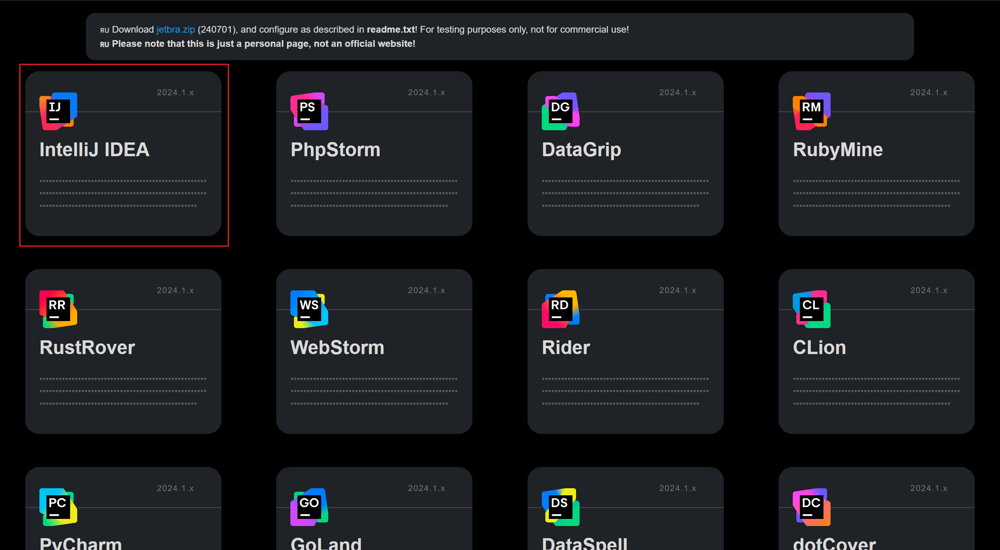

# 简介

JetBrains旗下的诸多软件（如IDEA、PyCharm、WebStorm）都非常好用，目前提供免费但功能受限社区版本，专业版高昂的费用让人望而却步。

有没有什么方法可以免费使用专业版呢？这便是本文要介绍的内容[public-gateway-checker](https://github.com/ipfs/public-gateway-checker)

## 注意！

1. 本站不提供任何破解软件安装包，仅介绍在互联网被广泛流传和使用的方法思路，信息来自网络，版权争议与本站无关。
2. 使用该方法获取的专业版，仅限用于学习和研究目的，请勿用于商业或者非法用途
3. 如果您喜欢该程序，请支持正版软件，购买注册，得到更好的正版服务。
4. 如果你是学生或教师，且能够使用教育邮箱，可以考虑[JetBrains免费教育许可证](https://www.jetbrains.com/zh-cn/community/education/#students)

# 教程

1.下载

前往官网下载自己想要使用的专业版软件即可

2.打开网站[jetbra](https://3.jetbra.in/)

2.查看测试结果，选择当前网络下可以连通的站点，打开。

点击蓝色超链接下载文件，解压后打开目录如下

此文件夹不可删除，建议放至C盘根目录或其他位置其他位置妥善保管

3.打开`scripts`文件夹

具体文件及对应的功能如下所示，按照自己的需要选择对应的vbs文件 右键-在命令提示符中打开 按照提示耐心等待即可

4.回到网页端复制对应的激活码

例如我要激活IDEA，点击复制，打开IDEA专业版软件，按照下图选择，填写激活码点击激活即可

这里我已经激活过了仅作演示，第一次使用idea可能是英文界面大同小异，大家自己探索一下即可

