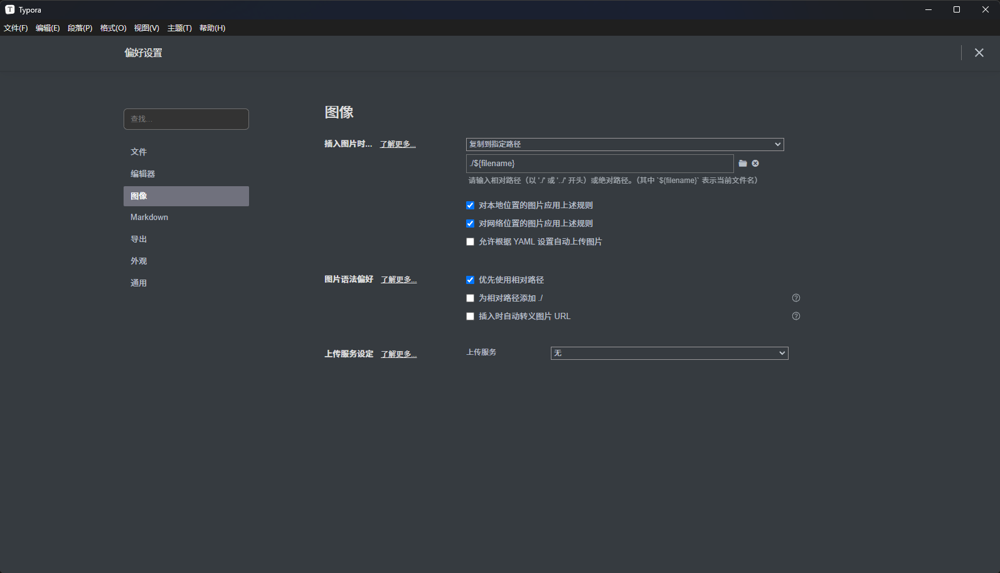
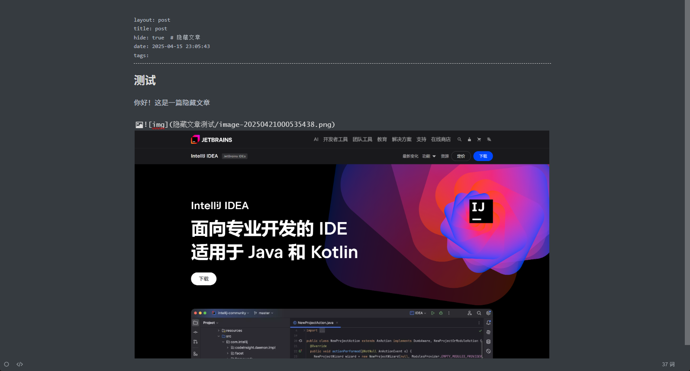

 # 引言

使用 Hexo 框架搭建了个人博客后，需要选择合适的工具来编辑博客文章。

Hexo 主要使用 [Markdown ](http://daringfireball.net/projects/markdown/) 语言解析文章，在几秒内，即可利用靓丽的主题生成静态网页。

目前针对 Hexo 博客文章编辑的解决方案繁多，以下为个人测试之后认为有较好用值得推荐的

## 1. Hexo 插件类

- [hexo-bridge](https://github.com/DeepSpaceHarbor/hexo-bridge)

- [hexo-admin](https://github.com/jaredly/hexo-admin)

- [hexo-admin-ehc](https://github.com/lwz7512/hexo-admin-ehc)

上述插件都是为博客添加网站管理面板，登录到后端对网站进行管理和文章编辑

注意！上述插件只能运行在将博客项目部署在服务器上的环境

如果你和我一样使用 GitHub pages 部署，即使安装插件后也只能在本地预览环境下使用，无法达到预期效果

## 2. 在线编辑器类

- [hexo 在线编辑器 - 白云苍狗](https://www.imalun.com/web_hexo_editor)

这个在线编辑器是我个人认为目前最好用的，功能完善、界面美观，支持图片复制粘贴、支持代码提示以及快捷设置文本样式，为作者大大点 str⭐。

还有一些手搓在线 markdown 编辑器并嵌入到博客项目中的，大家感兴趣自行研究，我个人认为有些太麻烦。

## 3. Markdown 编辑器

- [obsidian](https://obsidian.md/sync)

功能最为强大，且拥有海量插件，在 Windows、Linux、Mac、Android、iOS 都可下载使用，完全覆盖了主流操作系统，购买会员可以使用多端同步的功能。

即使是非会员也可通过 git 插件，借助 git 仓库来实现同步功能


Obsidian 虽功能强大但操作复杂不适合新手，因此本篇文章主要介绍 typora

后续会专门再写篇文章介绍 obsidian。

- [Typora](https://typoraio.cn/)

所见即所得，轻便且强大，无论是使用还是设置都非常适合新手入门

可以将将图片直接粘贴到文档内，同时编辑器自动将图片保存到指定文件夹，方便

# 正文
## 安装

目前 Typora 是收费的，详情请参考 [Typora 官方中文站](https://typoraio.cn/)

不过网上很容易找到免费或者修改后的版本，我目前使用的是果核 [Typora 1.10.8( 修改版) - Markdown编辑器 - 果核剥壳](https://www.ghxi.com/typora.html)

在我的使用过程中遇到了一个问题，更换多个渠道的 Typora 的安装包依然存在，目前我也不清楚问题原因

### Typora问题

当我在即时渲染模式下使用 Typora 时，编写了 markdown 文件的 yaml 代码后，输入正文第一行内容时会卡一下输入法，无法输入中文只成功输入了第一个字母，然后光标也自己跳转到了 yaml 代码部分。

解决方法便是点击左下角切换到源代码模式，输入第一行中文，之后再输入中文就没有问题了。

但如果还想在 `你好` 之前添加内容，还是会重复出现此问题，如果有更好的解决方法欢迎评论区交流


## 图片

### 引言

当我们想要在文章中添加图片，应该怎么做呢？

主要分为两种图床和本地图片引用方式

考虑到图床需要考虑国内外网络的兼容问题、费用问题等等

因此我更推荐使用本地图片引用，配合 hexo 资源文件夹以及Typora 编辑器插入图片时复制到指定路径功能，实现快捷方便的图片管理

### [hexo 资源文件夹](https://hexo.io/zh-cn/docs/asset-folders)

首先为大家介绍下和梳理 hexo 引用图片的各种方式，部分内容来自 hexo 文档

#### 全局资源文件夹

资源（Asset）代表 `source` 文件夹中除了文章以外的所有文件，例如图片、CSS、JS 文件等。 比方说，如果你的Hexo项目中只有少量图片，那最简单的方法就是将它们放在 `source/images` 文件夹中。 然后通过类似于 `` 的方法访问它们。

#### 文章资源文件夹

对于那些想要更有规律地提供图片和其他资源以及想要将他们的资源分布在各个文章上的人来说，Hexo也提供了更组织化的方式来管理资源。这个稍微有些复杂但是管理资源非常方便的功能可以通过将 `config.yml` 文件中的 `post_asset_folder` 选项设为 `true` 来打开。

```
post_asset_folder: true
```

当资源文件管理功能打开后，Hexo将会在你每一次通过 `hexo new [layout] <title>` 命令创建新文章时自动创建一个文件夹。这个资源文件夹将会有与这个文章文件一样的名字。将所有与你的文章有关的资源放在这个关联文件夹中之后，你可以通过相对路径来引用它们，这样你就得到了一个更简单而且方便得多的工作流。

#### 注意

 Hexo文档标题 `相对路径引用的标签插件` 中的内容大家无需在意，因为随着 hexo 的更新，已经支持将 `  ` 自动转换为 ``，也就是下面 `使用 Markdown 嵌入图片`部分的内容


#### 使用 Markdown 嵌入图片

[hexo-renderer-marked](https://github.com/hexojs/hexo-renderer-marked) 3.1.0 引入了一个新的选项，其允许你无需使用 `asset_img` 标签插件就可以在 markdown 中嵌入图片

如需启用：

调整 `_config.yml ` 如下设置

```
post_asset_folder: true  
marked:  
  prependRoot: true  
  postAsset: true
```

启用后，资源图片将会被自动解析为其对应文章的路径。 例如： `image.jpg` 位置为 `/2020/01/02/foo/image.jpg` ，这表示它是 `/2020/01/02/foo/` 文章的一张资源图片， `` 将会被解析为 `` 。

### 教程

首先按照 `文章资源文件夹` 所述，将`post_asset_folder` 选项打开

​​ [hexo-renderer-marked](https://github.com/hexojs/hexo-renderer-marked) 是 Hexo 默认安装的 Markdown 渲染器插件，无效手动安装

接着打开 Typora - 偏好设置 - 图像



按上图所示将插入图片时... 选择复制到指定路径，并在下方输入 `./${filename}`，保存设置

之后无论是本地的图片还是网络中的图片，复制后直接在 Typora 中粘贴

Typora 会自动将图片保存到 markdown 文件同名文件夹中，并使用 markdown 语法引用

从而实现优雅的编辑博客文章

%% 且 [hexo-renderer-marked](https://github.com/hexojs/hexo-renderer-marked) 会将 markdown 语法自动转换为 img 标签形式 %%




### 图片引用存在的问题

如果你修改了 `_config.yml` 中的 URL 配置，比如添加了 abbrlink 插件

或者将其设置为了其他的自己喜欢的形式

图片引用就会出现问题，导致图片无法正常显示

```
# URL
## Set your site url here. For example, if you use GitHub Page, set url as 'https://username.github.io/project'
url: https://mifazhan.top/
permalink: posts/:abbrlink/ 
```

一开始我也以为是 abbrlink 插件的问题，在 abbrlink 看到了这个议题

[# 有关当下版本启用post_asset_folder后与abbrlink插件冲突解决方案](https://github.com/ohroy/hexo-abbrlink/issues/68)

后续测试发现，与是否安装 abbrlink 无关，保持 URL 默认配置不会有问题

将其修改为了其他样式，比如 `permalink: posts/:title/`，文章图片同样无法正确加载

解决方案在上述议题中已有简略描述，碍于篇幅后续会专门再写一篇文章。
