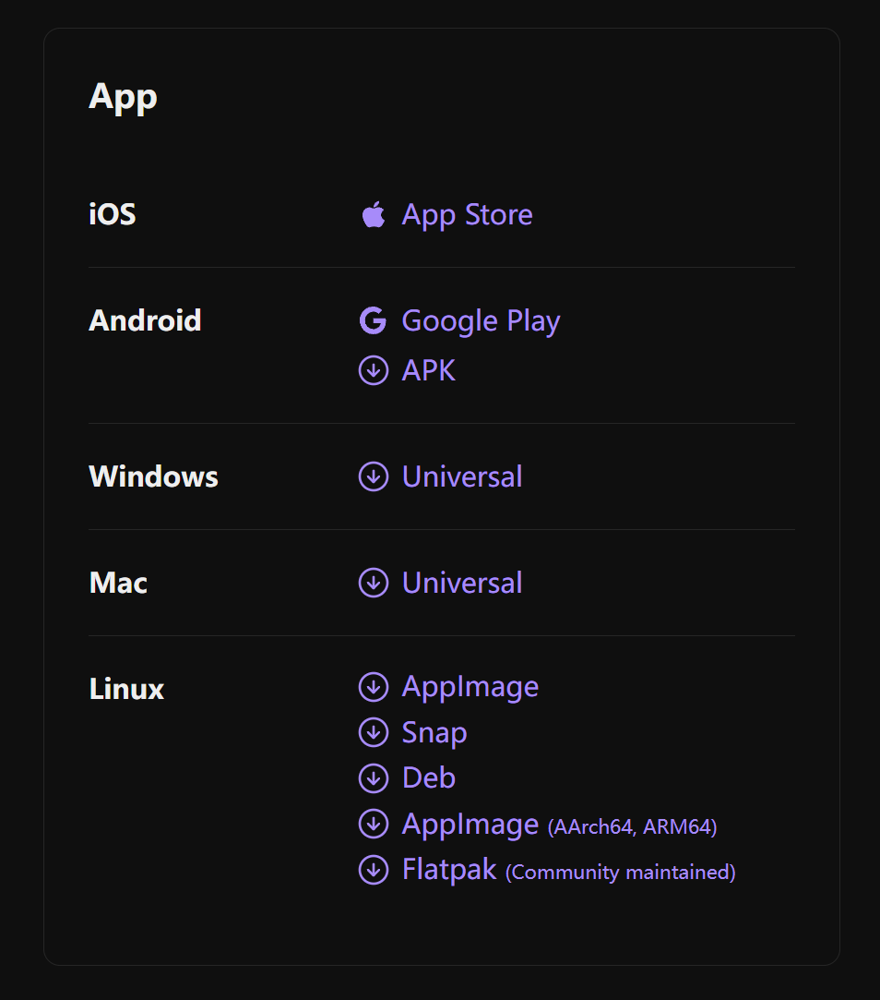
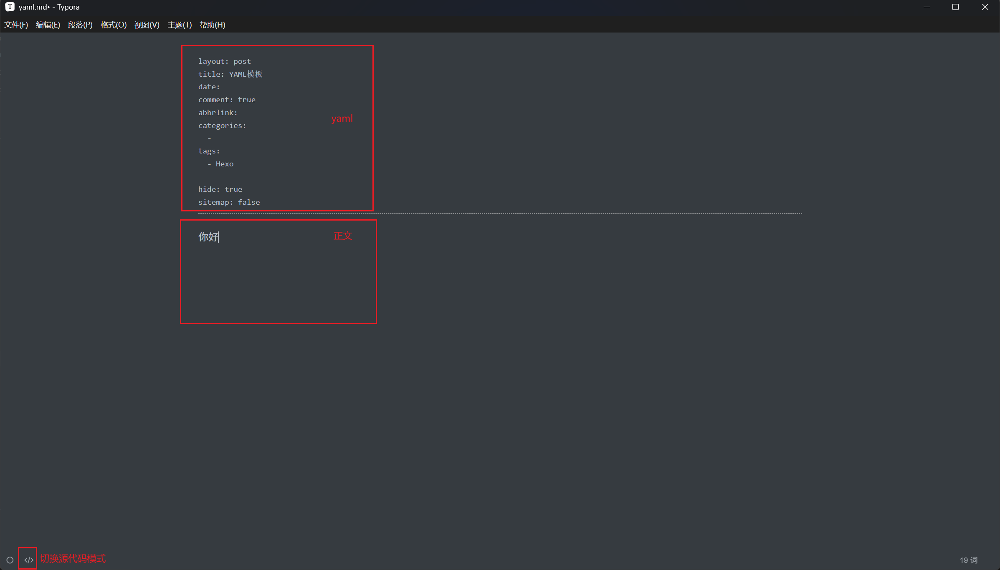

 # 引言

使用 Hexo 框架搭建了个人博客后，需要选择合适的工具来编辑博客文章。

Hexo 主要使用 [Markdown ](http://daringfireball.net/projects/markdown/) 语言解析文章，在几秒内，即可利用靓丽的主题生成静态网页。

目前针对 Hexo 博客文章编辑的解决方案繁多，以下为个人测试之后认为有较好用值得推荐的

## 1. Hexo 插件类

- [hexo-bridge](https://github.com/DeepSpaceHarbor/hexo-bridge)

- [hexo-admin](https://github.com/jaredly/hexo-admin)

- [hexo-admin-ehc](https://github.com/lwz7512/hexo-admin-ehc)

上述插件都是为博客添加网站管理面板，登录到后端对网站进行管理和文章编辑

注意！上述插件只能运行在将博客项目部署在服务器上的环境

如果你和我一样使用 GitHub pages 部署，即使安装插件后也只能在本地预览环境下使用，无法达到预期效果

## 2. 在线编辑器类

- [hexo 在线编辑器 - 白云苍狗](https://www.imalun.com/web_hexo_editor)

这个在线编辑器是我个人认为目前最好用的，功能完善、界面美观，支持图片复制粘贴、支持代码提示以及快捷设置文本样式，为作者大大点 str⭐。

还有一些手搓在线 markdown 编辑器并嵌入到博客项目中的，大家感兴趣自行研究，我个人认为有些太麻烦。

## 3. Markdown 编辑器

- [obsidian](https://obsidian.md/sync)

功能最为强大，且拥有海量插件，在 Windows、Linux、Mac、Android、iOS 都可下载使用，完全覆盖了主流操作系统，购买会员可以使用多端同步的功能。

即使是非会员也可通过 git 插件，借助 git 仓库来实现同步功能



Obsidian 虽功能强大但操作复杂不适合新手，因此本篇文章主要介绍 typora，后续会专门再写篇文章介绍 obsidian。

- [Typora](https://typoraio.cn/)

所见即所得，轻便且强大，无论是使用还是设置都非常适合新手入门

可以将将图片直接粘贴到文档内，同时编辑器自动将图片保存到指定文件夹，方便

# 正文
## 安装

目前 Typora 是收费的，详情请参考 [Typora 官方中文站](https://typoraio.cn/)

不过网上很容易找到免费或者修改后的版本，我目前使用的是果核 [Typora 1.10.8( 修改版) - Markdown编辑器 - 果核剥壳](https://www.ghxi.com/typora.html)

在我的使用过程中遇到了一个问题，更换多个渠道的 Typora 的安装包依然存在，目前我也不清楚问题原因

### 存在的问题

当使用 Typora 在即时渲染模式下，编写了 markdown 文件的 yaml 代码后，编辑正文第一行时会卡一下输入法，然后无法输入中文。

解决方法便是点击左下角切换到源代码模式，输入第一行中文，之后再输入中文就没有问题了。

但如果还想在 `你好` 之前添加内容，还是会重复出现此问题，如果有更好的解决方法欢迎评论区交流



## 图片

首先为大家介绍下和梳理 hexo 引用图片的各种方式

在使用 hexo 框架搭建好博客默认情况下，需要将图片放在 `source/images` 目录中

```

```