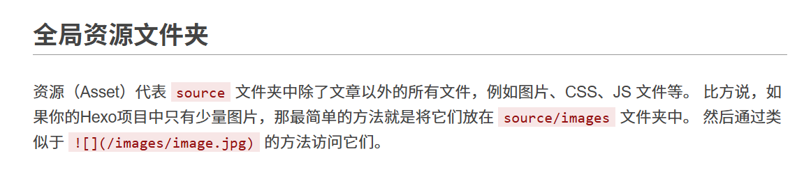
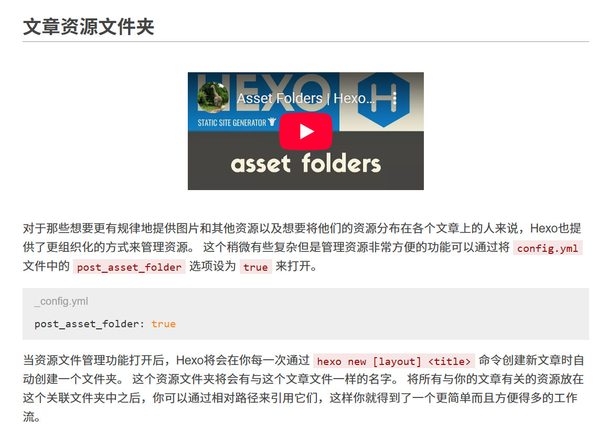
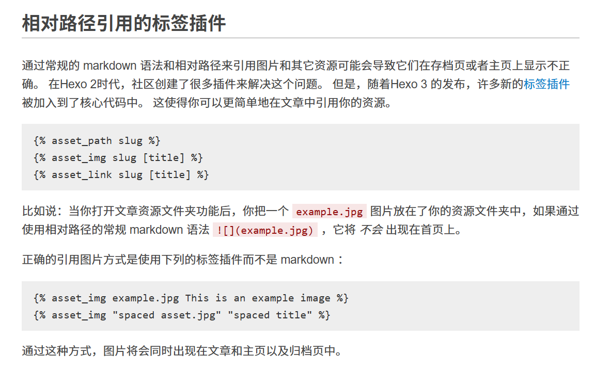
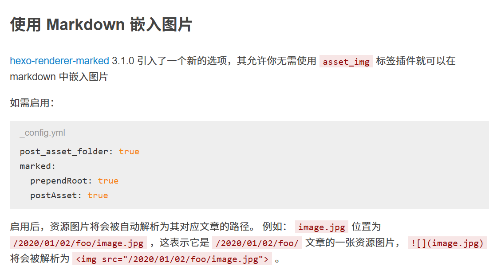
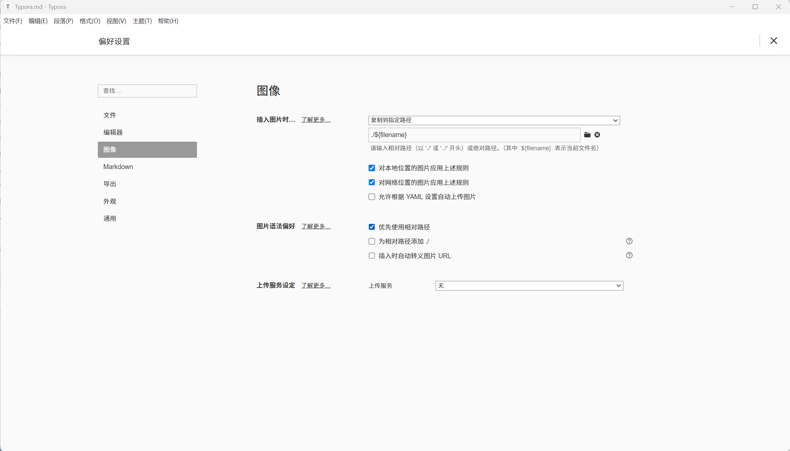

## 安装

目前 Typora 是收费的，详情请参考 [Typora 官方中文站](https://typoraio.cn/)

不过网上很容易找到免费或者修改后的版本，我目前使用的是果核 [Typora 1.10.8( 修改版) - Markdown编辑器 - 果核剥壳](https://www.ghxi.com/typora.html)

## Typora问题

在我的使用过程中遇到了一个问题，更换多个渠道的 Typora 的安装包依然存在，目前我也不清楚问题原因

当我在即时渲染模式下使用 Typora 编辑博客时

输入正文第一行内容时会卡一下输入法，无法输入中文只成功输入了第一个字母，然后光标也自己跳转到了 Yaml 代码部分。

但倘若编辑不带有 Yaml 代码的 markdown 文件则没有任何问题


解决方法便是点击左下角切换到源代码模式，输入第一行中文，之后无论哪种模式，再输入中文就没有问题了。

但如果还想在上图 `你好` 之前的位置添加内容，还是会重复出现此问题，如果有更好的解决方法欢迎评论区交流

## 图片

### 引言

当我们想要在文章中添加图片，应该怎么做呢？

主要分为两种图床和本地图片引用方式

考虑到图床需要考虑国内外网络的兼容问题、费用问题等等

因此我更推荐使用本地图片引用，配合 hexo 资源文件夹以及Typora 编辑器插入图片时复制到指定路径功能，实现快捷方便的图片管理

### hexo 资源文件夹

首先为大家介绍下和梳理 hexo 引用图片的各种方式，部分内容来自 [hexo 资源文件夹](https://hexo.io/zh-cn/docs/asset-folders)

#### 全局资源文件夹



#### 文章资源文件夹



#### 相对路径引用的标签插件



这是 Hexo 的专属标签插件，​**​自动适配 Hexo 资源文件夹的路径规则​**​。当开启 `post_asset_folder` 配置后，Hexo 会根据文章路径动态生成图片的最终 URL

但使用 `asset_img` 标签只能在已部署或者本地运行测试的博客页面中显示，在 Markdown编辑器内是无法预览图片的

再加上随着 hexo 的更新，已经支持将 `` 自动转换为 ``，也就是下面 `使用 Markdown 嵌入图片` 部分的内容

所以 `asset_img` 标签这种引用方法很少在编辑文章时直接使用

#### 使用 Markdown 嵌入图片



[hexo-renderer-marked](https://github.com/hexojs/hexo-renderer-marked) 是 Hexo 默认安装的 Markdown 渲染器插件，无效手动安装，检查 `post_asset_folder: true` 是否正确配置即可

### 教程

首先按照 `文章资源文件夹` 所述，将 `config.yml` 文件中的 `post_asset_folder` 选项设为 `true` 来打开。

```
post_asset_folder: true
```

接着打开 Typora - 偏好设置 - 图像



按上图所示将插入图片时... 调整为 复制到指定路径，并在下方输入 `./${filename}`，

将图片语法偏好调整为优先使用相对路径，保存设置

之后无论是本地的图片还是网络中的图片，复制后直接在 Typora 中粘贴

Typora 会自动将图片保存到 markdown 文件同名文件夹中，并使用 `` 语法引用

从而实现优雅地编辑博客文章

## 图片引用存在的问题

如果你修改了 `_config.yml` 中的 URL 配置，比如添加了 abbrlink 插件

或者将其设置为了其他的自己喜欢的形式

又或者 URL 中出现了中文

图片引用就会出现问题，导致图片无法正常显示

```
# URL
## Set your site url here. For example, if you use GitHub Page, set url as 'https://username.github.io/project'
url: https://mifazhan.top/
permalink: posts/:abbrlink/ 
```

一开始我也以为是 abbrlink 插件的问题，在 abbrlink 看到了这个议题

[# 有关当下版本启用post_asset_folder后与abbrlink插件冲突解决方案](https://github.com/ohroy/hexo-abbrlink/issues/68)

后续测试发现，与是否安装 abbrlink 无关，保持 URL 默认配置不会有问题

将其修改为了其他样式，比如 `permalink: posts/:title/`，文章图片同样无法正确加载

解决方案在上述议题中已有简略描述，碍于篇幅后续会专门再写一篇文章。


