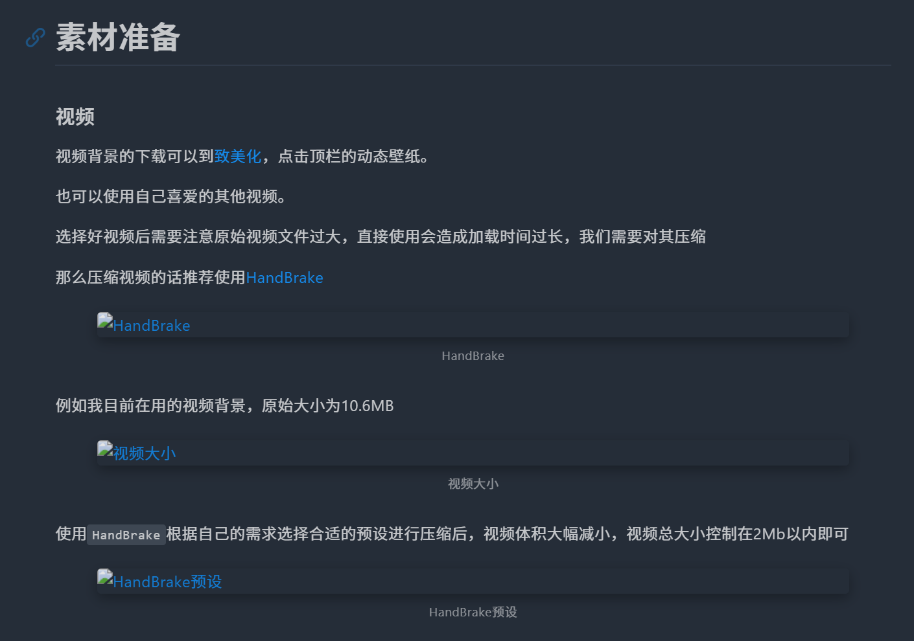

# 引言

之前文章我们介绍了使用 Typora 编辑博客文章[Hexo-博客文章编辑(Typora) - MiYingRuShi](https://mifazhan.top/posts/b915b0ef/)

即开启 `文章资源文件夹`，配合 Typora 编辑器的功能，实现方便快捷的文章编辑、图片管理

讲解了两种配置永久链接的方法 [Hexo-永久链接 - MiYingRuShi](https://mifazhan.top/posts/33b326d2/)，本博客采用第二种，即安装 hexo-abbrlink 插件

然而在配置永久链接之后，博客图片无法正常显示，本篇文章主要记录这个问题以及解决方法



## 版本

打开 `项目根目录\package.json` 文件即可看到当前 hexo 版本

请查看版本信息，以确保此文章内容适用于你的项目

```
"hexo": {
    "version": "7.3.0"
  }
```

## 默认配置

打开 [Hexo配置文档](https://hexo.io/zh-cn/docs/configuration.html)可以查看 `_config.yml` 各配置的功能

在使用 hexo 框架搭建博客后，其 URL 部分默认配置如下

```
# URL
## Set your site url here. For example, if you use GitHub Page, set url as 'https://username.github.io/project'
url: http://example.com
permalink: :year/:month/:day/:title/
```

## 图片引用方式

1、``

Markdown 语法

2、[img 标签](https://hexo.io/zh-cn/docs/asset-folders#%E7%9B%B8%E5%AF%B9%E8%B7%AF%E5%BE%84%E5%BC%95%E7%94%A8%E7%9A%84%E6%A0%87%E7%AD%BE%E6%8F%92%E4%BB%B6)

3、`asset_img` 标签

# 问题分析

在开始分析之前需要先明确当前的设置
- 启用post_asset_folder
- 使用相对路径的本地图片引用

最早出现图片无法显示问题是在安装 hexo-abbrlink 插件之后，于是想当然的以为是插件的问题

将 hexo-abbrlink 插件卸载后，保持 URL 默认设置，图片引用问题也确实解决了

但这个问题确实与abbrlink插件无关，而是与修改博客_config.yml配置文件中的URL选项有关。

即使按照 hexo 官方文档[永久链接（Permalinks） \| Hexo](https://hexo.io/zh-cn/docs/permalinks) 调整 Permalink，也有可能出现图片无法显示的问题

```
# URL
## Set your site url here. For example, if you use GitHub Page, set url as 'https://username.github.io/project'
url: https://mifazhan.top/
permalink: posts/:title/
```

例如将配置修改为上述形式后，文章图片也无法正确加载


无论是理应会自动转换的``，还是都无法正常显示

而这时使用asset_img 语法引用的图片则没有任何问题，依然可以正常显示。

这时倘若将配置改为`permalink: :title/`或改回默认，文章图片所有的引用都不会出问题


无论是理应会自动转换的``，还是[img 标签](https://hexo.io/zh-cn/docs/asset-folders#%E7%9B%B8%E5%AF%B9%E8%B7%AF%E5%BE%84%E5%BC%95%E7%94%A8%E7%9A%84%E6%A0%87%E7%AD%BE%E6%8F%92%E4%BB%B6)都无法正常显示

而这时使用asset_img 语法引用的图片则没有任何问题，依然可以正常显示。