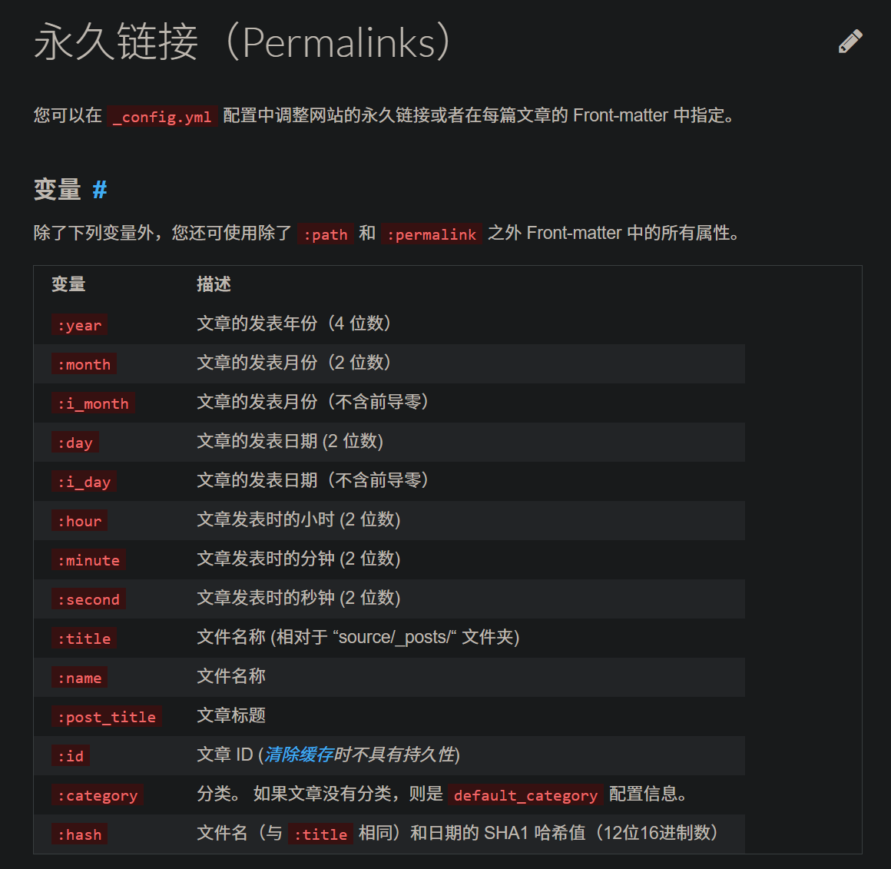

# 引言

[Hexo-博客文章编辑(Typora) - MiYingRuShi](https://mifazhan.top/posts/b915b0ef/)

之前我们介绍了，使用 Typora 编辑博客文章

当我在此（开启资源文件夹-本地图片引用）基础上，尝试调整 URL 配置来实现永久链接时

却发现修改 URL 配置后，图片莫名其妙的全部无法正常显示

本篇文章记录此问题的原因及解决方案

## 版本

打开 `项目根目录\package.json` 文件即可看到当前 hexo 版本

我的版本为 7.3.0

```
"hexo": {
    "version": "7.3.0"
  }
```

# _config 配置文件

## 默认配置

打开 [Hexo配置文档](https://hexo.io/zh-cn/docs/configuration.html)可以查看 `_config.yml` 各配置的功能

在使用 hexo 框架搭建博客后，其 URL 部分默认配置如下

```
# URL
## Set your site url here. For example, if you use GitHub Page, set url as 'https://username.github.io/project'
url: http://example.com
permalink: :year/:month/:day/:title/
```

`url: http://example.com` 部分正常修改为自己网址即可

而 permalink 默认配置过于冗长，且一旦更改文件名，文章的 URL 就会改变，不利于搜索引擎收录和外部引用

因此多数人会调整配置或者假装插件来实现永久链接
## 永久链接

### Hexo 文档

按照 hexo 官方文档[永久链接（Permalinks） \| Hexo](https://hexo.io/zh-cn/docs/permalinks) 调整 Permalink



文档中记录了所有变量，以及对应的功能

用户可以根据自己的喜好调整

```
permalink: :layout/:year:month:day:hour:minute:second.html
```

例如上述配置将 URL 设置为了纯数字形式的文章创建时间

### 插件

通过安装插件，如 [GitHub - ohroy/hexo-abbrlink: create one and only link for every post for hexo](https://github.com/ohroy/hexo-abbrlink) 来实现永久链接

此类插件有多个根据自己的需求选择即可

#### 安装

在项目根目录打开命令行工具或 Git Bash

执行命令安装

```
npm install hexo-abbrlink --save
```

修改 config.yml 文件中的 permalink 为

```
permalink: posts/:abbrlink/ 
# 或
permalink: posts/:abbrlink.html
```

在 `_config.yml ` 添加配置

```
# abbrlink config
abbrlink:
  alg: crc32      # Algorithm used to calc abbrlink. Support crc16(default) and crc32
  rep: hex        # Representation of abbrlink in URLs. Support dec(default) and hex
  drafts: false   # Whether to generate abbrlink for drafts. (false in default)
  force: false    # Enable force mode. In this mode, the plugin will ignore the cache, and calc the abbrlink for every post even it already had an abbrlink. (false in default)
  writeback: true # Whether to write changes to front-matters back to the actual markdown files. (true in default)
```
	
生成的链接将如下所示：

```
crc16 & hex
https://post.zz173.com/posts/66c8.html

crc16 & dec
https://post.zz173.com/posts/65535.html
```

```
crc32 & hex
https://post.zz173.com/posts/8ddf18fb.html

crc32 & dec
https://post.zz173.com/posts/1690090958.html
```

# 图片引用问题

经过测试

URL 中含有中文