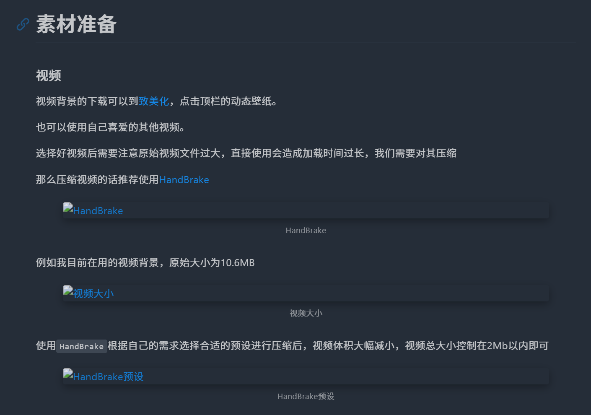

# 引言

之前文章我们介绍了使用 Typora 编辑博客文章 [Hexo-博客文章编辑(Typora) - MiYingRuShi](https://mifazhan.top/posts/b915b0ef/)

即开启 `文章资源文件夹`，配合 Typora 编辑器的功能，实现方便快捷的文章编辑、图片管理

讲解了两种配置永久链接的方法 [Hexo-永久链接 - MiYingRuShi](https://mifazhan.top/posts/33b326d2/)，本博客采用第二种，即安装 hexo-abbrlink 插件

然而在配置永久链接之后，博客图片无法正常显示，本篇文章主要记录这个问题以及解决方法



## 版本

打开 `项目根目录\package.json` 文件即可看到当前 hexo 版本

请查看版本信息，以确保此文章内容适用于你的项目

```
"hexo": {
    "version": "7.3.0"
  }
```

## 默认配置

打开 [Hexo配置文档](https://hexo.io/zh-cn/docs/configuration.html)可以查看 `_config.yml` 各配置的功能

在使用 hexo 框架搭建博客后，其 URL 部分默认配置如下

```
# URL
## Set your site url here. For example, if you use GitHub Page, set url as 'https://username.github.io/project'
url: http://example.com
permalink: :year/:month/:day/:title/
```

# Hexo 的图片引用方式

 1、``

Markdown 语法

早期版本的 hexo 无法直接通过 Markdown 语法引用图片

随着 hexo 的更新，已经支持将 `` 自动转换为 ``

2、`` 标签

HTML 的 `` 标签，没什么好介绍的

3、`asset_img` 标签

这是 Hexo 的专属标签插件，​**​自动适配 Hexo 资源文件夹的路径规则​**​。当开启 `post_asset_folder` 配置后，Hexo 会根据文章路径动态生成图片的最终 URL

但使用 `asset_img` 标签只能在已部署或者本地运行测试的博客页面中显示，在 Markdown 编辑器内是无法预览图片的

再加上随着 hexo 的更新，已经支持将 `` 自动转换为 ``

所以 `asset_img` 标签这种引用方法很少在编辑文章时直接使用

# 问题分析

在开始分析之前需要先明确当前的设置
- 启用 post_asset_folder
- 使用相对路径的本地图片引用

最早出现图片无法显示问题是在安装 hexo-abbrlink 插件之后，于是想当然的以为是插件的问题

将 hexo-abbrlink 插件卸载后，保持 URL 默认设置，图片引用问题也确实解决了

但这个问题确实与 abbrlink 插件无关，而是与修改博客_config. Yml 配置文件中的 URL 选项有关。

## 测试 Permalink 配置

即使不安装 abbrlink 插件，仅按照 hexo 官方文档[永久链接（Permalinks） \| Hexo](https://hexo.io/zh-cn/docs/permalinks) 调整 Permalink，也有可能出现图片无法显示的问题

```
# URL
## Set your site url here. For example, if you use GitHub Page, set url as 'https://username.github.io/project'
url: https://mifazhan.top/
permalink: posts/:title/
```

例如将配置修改为上述形式后，文章图片也无法正确加载

无论是理应会自动转换的 ``，还是 img 标签都无法正常显示

而这时使用 asset_img 语法引用的图片则没有任何问题，依然可以正常显示。

这时倘若将配置改为 `permalink: :title/`，文章图片所有的引用都不会出问题

那如果一直使用 `permalink: :title/` 是不是万事大吉了呢？

并不是， `: title/` 关键字获取的是 Markdown 文件的名称，当我们习惯性的把 markdown 文件用中文命名时，URL 中就会出现中文，也可能会造成图片无法正常显示

且重命名文件又会改变文章 URL

## 问题根源

路径未适配资源文件夹结构
Hexo 默认会将资源文件输出到 public/<文章路径>/ 下，但直接写时，Markdown 解析器可能按相对文章的位置查找资源，而非适配 Hexo 生成的最终路径。
当使用 hexo-abbrlink 或自定义 permalink 格式后，文章的 URL 层级结构发生变化，导致以下两种引用方式失效：
```
               # 相对路径失效
        # 绝对路径错误
```

## 解决方法

既然我们需要修改 URL 配置，而修改后 `` 和 `` 标签引用方法会失效

那么索性寻找方法，将 `` 引用方法转换为 ​​asset_img 语法

Hexo-image-link 插件完美解决了这个问题

[GitHub - cocowool/hexo-image-link: 当MD中引用本地文件时，处理生成的html中的图片链接。](https://github.com/cocowool/hexo-image-link)


## Hexo-image-link


安装过程不再赘述，按照文档介绍进行安装即可

安装完成后 `hexo clean && hexo g && hexo s` 本地测试问题解决

# 结语

以上啰啰嗦嗦的一大堆看不懂也没有关系，
