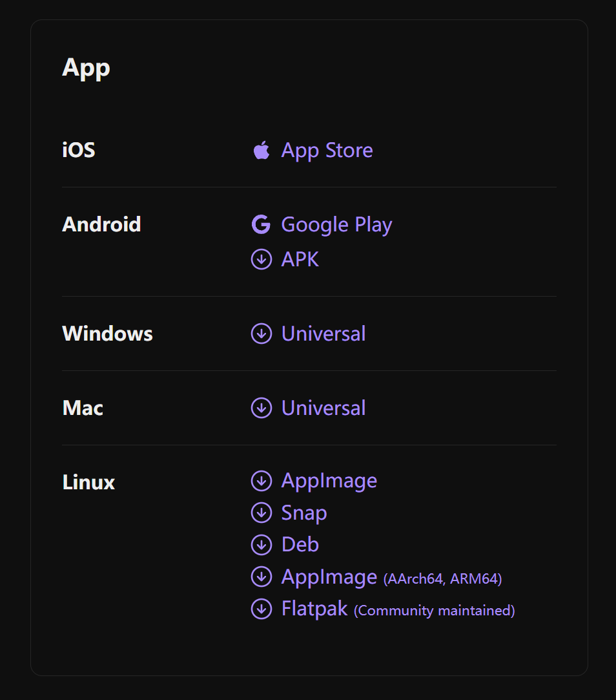

# 引言

使用 Hexo 框架搭建了个人博客后，需要选择合适的工具来编辑博客文章。

Hexo 主要使用 [Markdown ](http://daringfireball.net/projects/markdown/) 语言解析文章，在几秒内，即可利用靓丽的主题生成静态网页。

目前针对 Hexo 博客文章编辑的解决方案繁多，以下为个人测试之后认为有较好用值得推荐的

# 1. Hexo 插件类

- [hexo-bridge](https://github.com/DeepSpaceHarbor/hexo-bridge)

- [hexo-admin](https://github.com/jaredly/hexo-admin)

- [hexo-admin-ehc](https://github.com/lwz7512/hexo-admin-ehc)

上述插件都是为博客添加网站管理面板，登录到后端对网站进行管理和文章编辑

注意！上述插件需要开放端口用于登录后端，因此只推荐将博客项目部署在自己服务器用户使用

如果你和我一样使用 GitHub pages 部署或其他静态托管服务

即使安装插件后也只能在本地预览环境下使用，无法达到最佳效果

# 2. 在线编辑器类

- [hexo 在线编辑器 - 白云苍狗](https://www.imalun.com/web_hexo_editor)

这个在线编辑器是我个人认为目前最好用的，功能完善、界面美观，支持图片复制粘贴、支持代码提示以及快捷设置文本样式，为作者大大点 str⭐。

还有一些手搓在线 markdown 编辑器并嵌入到博客项目中的，大家感兴趣自行研究，我个人认为有些太麻烦。

# 3. Markdown 编辑器

- [obsidian](https://obsidian.md/sync)

功能最为强大，且拥有海量插件，在 Windows、Linux、Mac、Android、iOS 都可下载使用，

完全覆盖了主流操作系统，购买会员可以使用软件的多端同步功能。

即使是非会员也可通过 git 插件，借助 GitHub 仓库来实现同步功能

Obsidian 虽功能强大但操作复杂不适合新手，后续会专门再写篇文章介绍 obsidian。

- [Typora](https://typoraio.cn/)

所见即所得，轻便且强大，无论是使用还是设置都非常适合新手入门

再配合Typora 插入图片功能，即可实现无论是本地的图片还是网络中的图片，复制后直接在 Typora 中粘贴

Typora 会自动将图片保存到 markdown 文件同名文件夹中，并使用 `` 语法引用

详细教程在这里[Hexo-使用Typora编辑博客文章 - MiYingRuShi](https://mifazhan.top/posts/52b6ead4/)
